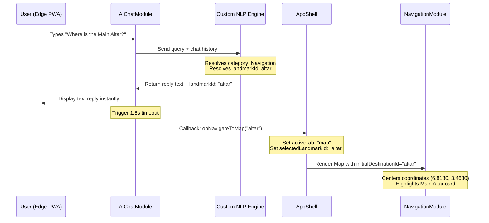
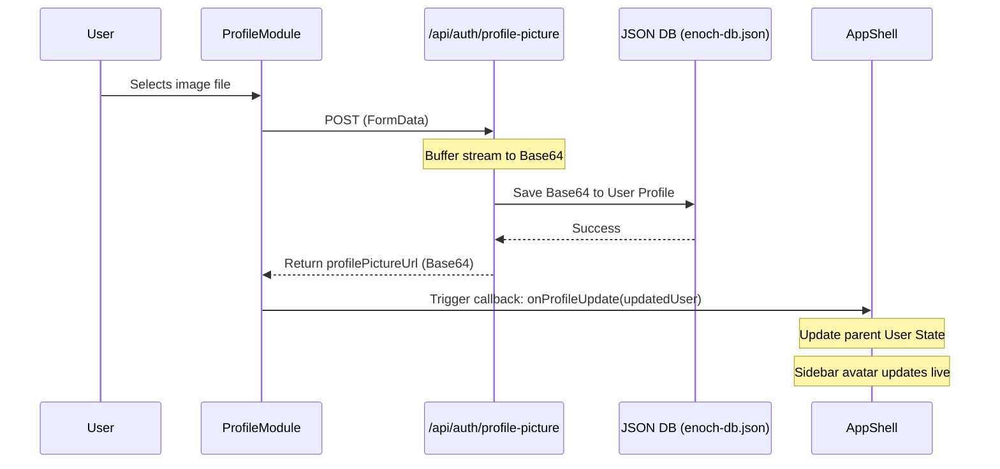

# ENOCH: System Architecture Document

**Redemption City Autonomous AI Guide**
**Version:** 3.0 (Offline-First Edge Monolith)

---

## 1. Executive Summary
ENOCH is an intelligent, offline-first progressive web application (PWA) designed to serve as the autonomous guide for attendees in Redemption City. Born from the need to provide hyper-local, ultra-fast navigation, dining indexes, accommodations, and emergency support in a congested network environment, ENOCH operates on an edge-compute paradigm.

The application functions 100% autonomously for all navigation, chat, and local indexing queries once the client-side assets are cached. Runtime processing is kept client-side, eliminating server-side inference overhead, bypasses GLIBC compilation errors during deployment, and guarantees uptime in cellular dead zones.

---

## 2. High-Level System Topology
The system is decoupled into two domains:

1. **The Edge PWA (Client-Side)**
   - Houses the UI, Map Coordinates Grid, and Custom NLP Chat Engine.
   - Manages all navigation routing, category indexes, and dialogue memory.

2. **The Command Node (Next.js Monolithic Backend)**
   - Handles JWT validation, authentication, user telemetry, and chat log persistence.
   - Runs stateless route handlers connected to a localized, offline-safe JSON database.

---

## 3. Frontend Architecture (Progressive Web App)
**Tech Stack:** Next.js, React, Tailwind CSS

The frontend is styled to look like a premium, native operating system.

- **Design System:** Deep dark aesthetics (`#121314`, `#1b1c1d`) accented with the signature Enoch Green (`#c3f400`). Uses glassmorphism and subtle micro-animations for high-fidelity interactive feedback.
- **Service Worker & Caching:** Intercepts network assets (HTML, CSS, JS, Map grids) to ensure instantaneous, offline-ready starts.
- **Routing:** Handled via a dynamic React state-driven `AppShell` allowing fast, zero-delay switching between tabs (Home, Map, Devices, Chat, Profile).

---

## 4. The Offline NLP Engine (Custom Edge AI)
**Tech Stack:** Pure JavaScript/TypeScript, RegExp matching, local JSON Knowledge Base

To ensure immediate response times, absolute privacy, and zero native runtime dependencies (preventing binary compilation errors in serverless pipelines), ENOCH uses a custom, keyword-weighted NLP Engine (`chat-engine.ts`).

### 4.1. Local Knowledge Base Matrix
All factual context is stored in a local structured JSON format (`knowledge-base.json`), mapping contact hotlines, descriptions, and locations across categories (Food, Banking, Lodging, Emergency, Medical, Hotlines, Academic, Recreation, History, Navigation, Facilities).

### 4.2. Keyword-Weighted Classification & Scoring Heuristics
When a user submits a query:
1. **Intents & Category Triggers:** The engine classifies the query into one of several general categories using a weighted token search.
2. **Specific POI Recognition:** Each entry in the database is scored based on user query matches against its unique keywords. 
   - Generic terms (like "bank" or "restaurant") are given minimal weight unless they form a perfect query match.
   - Distinct brand names or exact multi-word phrases (like "Truly Hospitable" or "Yellow Bus") receive a high boost.
3. **Selection Threshold:** If a specific point of interest scores high enough (threshold $\ge 4.0$), the system serves its exact details. Otherwise, it defaults to a category-wide listing.

### 4.3. Conversational Memory & Context Resolution
To support follow-up natural language prompts (e.g., *"any other"*, *"give me more"*, *"what else"*):
* The engine accepts a dialogue `history` parameter containing the sequence of preceding user and assistant messages.
* When a follow-up phrase is detected, the engine scans the history backwards to find the last resolved category context.
* If a specific item was previously returned (e.g. Mimi's Restaurant), the engine extracts its display name from the last assistant response and outputs a directory list of **other** options within that category while **filtering out** the active item.

### 4.4. Directory List Formatting
If the user asks a general category query (e.g., *"where can I get food"* or *"hotels"*), the engine queries the knowledge base for all items in that category and formats them into a neat, readable directory with icons (📍) and full details.

---

## 5. Backend Architecture (Serverless Next.js API Routes)
**Tech Stack:** Next.js Route Handlers (`app/api`), JSON Mock Database (`enoch-db.json`), JWT

To simplify the deployment pipeline and eliminate CORS issues, ENOCH functions as a serverless monolith.

### 5.1. Database & Persistence
Data is stored using a local JSON database schema (`enoch-db.json`) accessed directly via Next.js Route Handlers, persisting:
* `Users`: Profiles, credentials, and uploaded profile pictures.
* `Devices`: Bluetooth/mesh coordinates and status.
* `Locations`: User GPS telemetry logs.
* `Messages`: Historical logs for chat retrieval.

### 5.2. Authentication & Security
* **JWT Bearer Auth:** The client posts credentials to `/api/auth/login`. The server verifies details and issues a signed JSON Web Token.
* **Stateless Validation:** Protected routes inspect the `Authorization: Bearer <token>` header to authenticate the user securely.

### 5.3. Profile Photo Base64 Monolithic Storage
To maintain a completely serverless footprint without external storage buckets:
* The `/api/auth/profile-picture` route handler receives image file uploads (max 2MB), reads them into buffer streams, and encodes them into inline base64 Data URLs (`data:image/png;base64,...`).
* The data URL is saved directly into the user's document object inside the JSON database (`enoch-db.json`).
* This permits persistent profile picture uploads that sync live with the client UI and load instantly.

---

## 6. Layout Spacing and Aesthetics
To ensure a premium user experience on mobile screens:
* **Interactive Zones Spacing:** Bottom navigation bars (`fixed bottom-6`) and chat text input bars (`absolute bottom-28`) are spaced with a 14px safety gap on narrow viewports to prevent mis-clicks.
* **Scroll Area Clipping Prevention:** The scroll container padding is expanded to `pb-56`, forcing scrollable history content to slide under the translucent chat bar clearly.
* **Futuristic Avatar SVG:** Initial loads use a local vector image (`default-avatar.svg`) featuring a glowing neon outline instead of generic browser avatars.

---

## 7. Data Flow & Execution Pipelines

### 7.1. Chat-to-Map Redirection Flow

### 7.2. Avatar Upload Sync Flow

---

## 8. Summary of Architectural Triumphs
* **Infinite Scalability:** Client-side execution of all NLP classifications and map coordinates rendering ensures zero server-side CPU utilization cost.
* **Absolute Privacy:** Dialogues, search selections, and mesh telemetry remain local to the browser.
* **Render-Ready Portability:** Bypassing native C++ drivers (like `sqlite3`) and heavy NLP libraries (like `@nlpjs/core`) ensures that the Next.js app builds instantly on standard Node.js serverless runtimes.
